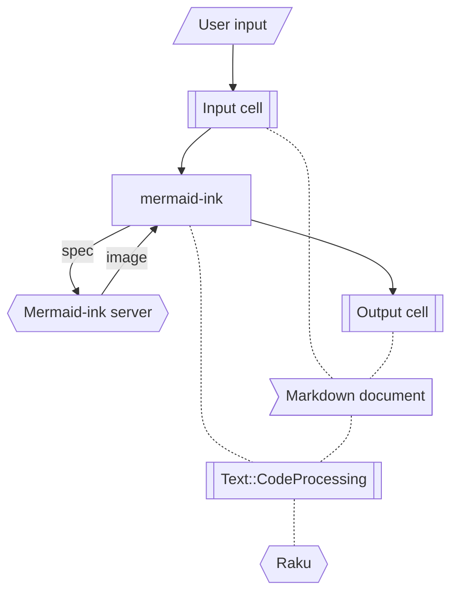

# WWW::MermaidInk Raku package

The function `mermaid-ink` of the Raku package ["WWW::MermaidInk"](https://github.com/antononcube/Raku-WWW-MermaidInk)
gets images corresponding to a Mermaid-js specifications via the web [Mermaid-ink](https://mermaid.ink) interface of [Mermaid-js](https://mermaid.js.org).

----

## Usage

`use WWW::MermaidInk`   
loads the package.

`mermaid-ink($spec)`   
retrieves an image defined by the spec `$spec` from Mermaid's Ink Web interface.

`mermaid-ink($spec format => 'md-image')`   
returns a string that is a Markdown image specification in Base64 format.

`mermaid-ink($spec file => fileName)`   
exports the retrieved image into a specified PNG file.

`mermaid-ink($spec file => Whatever)`   
exports the retrieved image into the file `$*CMD ~ /out.png`.


### Details & Options

- Mermaid lets you create diagrams and visualizations using text and code.

- Mermaid has different types of diagrams: Flowchart, Sequence Diagram, Class Diagram, State Diagram, Entity Relationship Diagram, User Journey, Gantt, Pie Chart, Requirement Diagram, and others. It is a JavaScript based diagramming and charting tool that renders Markdown-inspired text definitions to create and modify diagrams dynamically.

- `mermaid-ink` uses the Mermaid's functionalities via the Web interface "https://mermaid.ink/img".

- The first argument can be a string (that is, a mermaid-js specification) or a list of pairs.

- The option "directives" can be used to control the layout of Mermaid diagrams if the first argument is a list of pairs.

- `mermaid-ink` produces images only.

-----

## Examples

### Basic Examples

Generate a flowchart from a Mermaid specification:

```raku, results=asis
use WWW::MermaidInk;

'graph TD 
   WL --> |ZMQ|Python --> |ZMQ|WL' 
 ==> mermaid-ink(format=>'md-image')
```

Create a Markdown image expression from a class diagram:

```raku, results=asis
my $spec = q:to/END/;
classDiagram
    Animal <|-- Duck
    Animal <|-- Fish
    Animal <|-- Zebra
    Animal : +int age
    Animal : +String gender
    Animal: +isMammal()
    Animal: +mate()
    class Duck{
        +String beakColor
        +swim()
        +quack()
    }
    class Fish{
        -int sizeInFeet
        -canEat()
    }
    class Zebra{
        +bool is_wild
        +run()
    }
END

mermaid-ink($spec, format=>'md-image')    
```

### Scope

The first argument can be a list of pairs -- the corresponding Mermaid-js graph is produced.
Here are the edges of directed graph:

```raku, results=asis
my @edges = ['1' => '3', '3' => '1', '1' => '4', '2' => '3', '2' => '4', '3' => '4'];
```

Here is the corresponding mermaid-js image:

```raku, results=asis
mermaid-ink(@edges, format=>'md-image')
```

------

## Flowchart

This flowchart summarizes the execution path of obtaining Mermaid images in a Markdown document:  



----- 

## References


- [GitHub - mermaid-js/mermaid: Generation of diagram and flowchart from text in a similar manner as markdown](https://github.com/mermaid-js/mermaid)

- [mermaid - Markdownish syntax for generating flowcharts, sequence diagrams, class diagrams, gantt charts and git graphs.](https://mermaid-js.github.io/mermaid)

- [GitHub - mermaid-js/mermaid-cli: Command line tool for the Mermaid library](https://github.com/mermaid-js/mermaid-cli)

- [Online FlowChart & Diagrams Editor - Mermaid Live Editor](https://mermaid.live/)
